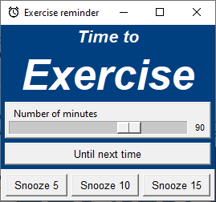

# Reminder

Simple reminder application which sleeps in the taskbar. Pops up at set intervals with snooze functionality. Customizable colors, texts and icon. Written in python / tkinter.




## Installation (Windows 10)
### 1. Install Python3
Default install path in Windows 10: *C:\Users\\\<USER>\AppData\Local\Programs\Python\Python310*

### 2. Add to Windows path
Add following to **Environment Variables > System Variables > Path**
* C:\Users\\\<USER>\AppData\Local\Programs\Python\Python310
* C:\Users\\\<USER>\AppData\Local\Programs\Python\Python310\Scripts

### 3. Clone source code
Clone source code to folder.

### 4. Start Powershell
```Powershell
# Navigate to folder
cd <FOLDER>

# Create venv
py -m venv reminder_venv

# Activate venv (do NOT use activate.bat in Powershell)
.\reminder_venv\Scripts\activate 
# Prompt shifts to (venv) C:\....

# Install packages from requirements.txt
py -m pip install -r requirements.txt

# Run reminder.py with help option
# Displays usage and creates default_settings.yaml
py reminder.py -h

# Run reminder.py with custom settings
py reminder.py -s <SETTINGS_FILE_NAME>

# Run reminder.py with default settings
py reminder.py
```

### 5. Start at boot / Create shortcut in Windows Startup Folder
Open Windows Startup Folder

- Press **Windows + R**, then type ```shell:startup```

Right-Click and select **New > Shortcut**

- As *location* set:
```Powershell
"C:\Program Files\PowerShell\7\pwsh.exe" -command "& <PATH_TO_PYTHONW.EXE_IN_REMINDER_VENV>\pythonw.exe <PATH_TO_REMINDER.PY>\reminder.py -s <PATH_TO_SETTINGS.YAML>\settings.yaml
```
Note: ```<PATH_TO_PYTHONW.EXE_IN_REMINDER_VENV>``` should be the folder path from *Step 3* followed by ```\reminder_venv\Scripts```.

## Configuration
Configuration file is optional. Below file content shows the default values. Only lines differing from the default values need to be set. 

```YAML
default_timeout_in_minutes: 90
icon_image: alarm_icon.png
max_timeout_in_minutes: 120
min_timeout_in_minutes: 20
pre_title: Time to
startup_timeout_in_minutes: 90
title: Exercise
title_color: '#FFFFFF'
window_background_color: '#004080'
window_title: Exercise reminder
```

Examle: Run the application with below file content to use default values, except for the ```default_timeout_in_minutes```, which is overridden to ```60```.
```YAML
default_timeout_in_minutes: 60
```

## Useful python scripts


```python
# Check python version
py --version

# Upgrade pip
py -m pip install --user --upgrade pip 
# or
py -m pip install --upgrade pip

# Create venv
py -m venv <VENV_NAME>

# Activate venv
.\<VENV_NAME>\Scripts\activate.bat

# Install packages
py -m pip install <PACKAGE>

# View installed packages
py -m pip freeze

# Export packages to requirements.txt
py -m pip freeze > requirements.txt

# Install packages from requirements.txt
py -m pip install -r requirements.txt
```

